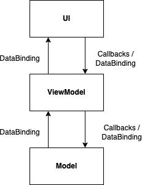
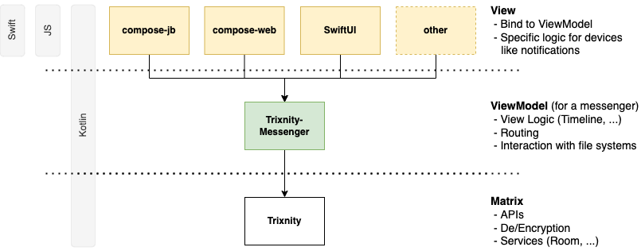

# Trixnity Messenger - A headless Matrix messenger

Trixnity Messenger provides extensions on top of [Trixnity](https://gitlab.com/trixnity/trixnity)
geared towards building a multiplatform messenger. It is agnostic to the UI and supports all technologies that are interoperable with
Kotlin. UI frameworks that are reactive like
[Compose Multiplatform](https://www.jetbrains.com/lp/compose-mpp), [SwiftUI](https://developer.apple.com/xcode/swiftui/)
, or [ReactJS](https://reactjs.org/) are best suited, since the changes in Trixnity Messenger can be reflected in the
component by binding to the view model.

**You need help? Ask your questions in [#trixnity-messenger:imbitbu.de](https://matrix.to/#/#trixnity-messenger:imbitbu.de).**

## MVVM

Trixnity Messenger follows the MVVM pattern, in particular it represents the view model (VM) part. Trixnity is the
model (M), containing all Matrix-related logic. The view (V) on top of Trixnity Messenger is the presentation geared
towards the user.



This patterns frees the UI layer from lots of logic that can be complicated (and thus needs to be tested). In an ideal
case the UI just consumes information provided by the view model and presents it. When user interaction occurs, the
corresponding methods in the view model are called (which can lead to changes in the model and therefore the view model)
.

This is an overview on how different UI technologies can be used on top of trixnity-messenger:



## Setup

## Configuration

Trixnity Messenger can be configured via dependency injection (DI). It uses [Koin](https://insert-koin.io/). A Koin
application is implicitly created in the ```de.connect2x.trixnity.messenger.viewmodel.RootViewModel```. You can provide
additional modules to override the standard module (```de.connect2x.trixnity.messenger.trixnityMessengerModule```).
See [i18n](#i18n) on how to override standard behaviour.

```kotlin
import de.connect2x.trixnity.messenger.viewmodel.RootViewModel

val rootViewModel = RootViewModel( // creates a Koin Application under the hood; access with `rootViewModel.koin`
    // ...
)
```

### Customize view models

In order to customize the behaviour of the messenger, all view models can be replaced or extended via the DI. For
example, one might customize the login logic.

This is the new view model (it just extends existing behaviour):

```kotlin
class MyLoginViewModel(
    // params
) : LoginViewModelImpl(
    // params
) {
    val isDemoVersion = true
}
```

Then, we have to register the new view model in a module:

```kotlin
val demoVersionModule = module {
    single<LoginViewModelFactory> {
        object : LoginViewModelFactory {
            override fun newLoginViewModel(
                // params
            ): LoginViewModel {
                return TimLoginViewModel(
                    // params
                )
            }
        }
    }
}
```

```kotlin
val rootViewModel = RootViewModel(
    // ...
    modules = listOf(demoVersionModule),
)
```

### i18n

Trixnity Messenger comes with a set of standard translations for some states that can occur. It currently supports
English (en) and German (de). It uses a simple
[Kotlin file](src/commonMain/kotlin/de/connect2x/trixnity/messenger/util/I18n.kt) for all translations.

#### Override

To override some or all of the messages, the I18n can be replaced by your own class by inheriting
[I18nBase](src/commonMain/kotlin/de/connect2x/trixnity/messenger/util/I18n.kt) and overriding some or all messages.

```kotlin
import de.connect2x.trixnity.messenger.ChangedI18n
import de.connect2x.trixnity.messenger.trixnityMessengerModule
import de.connect2x.trixnity.messenger.viewmodel.RootViewModelImpl
import org.koin.dsl.koinApplication
import org.koin.dsl.module

val changedI18nModule = module {
    single<I18n> { object : ChangedI18n(get()) {} }
}
// ...

val koinApplication = koinApplication {
    modules(
        trixnityMessengerModule(),
        changedI18nModule,
    )
}
val rootViewModel = RootViewModelImpl(
    // ...
    koinApplication = koinApplication,
)
```

#### Extend

If you want to extend the existing I18n, you can create an additional I18n module and inject it into the code
where it is needed.

```kotlin
val myI18nModule = module {
    single<MyI18n> { object : MyI18n(get()) {} }
}
// ...

class MyViewModel {
    // ...
    val myI18n = di.get<MyI18n>()
    val message = myI18n.myAdditionalMessage()
    // ...
}
```

## Commercial license and support
If you need a commercial license or support contact us at [kontakt@connect2x.de](mailto:kontakt@connect2x.de).
