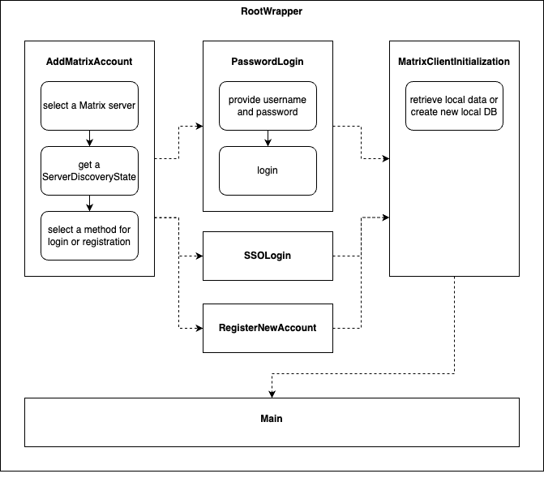
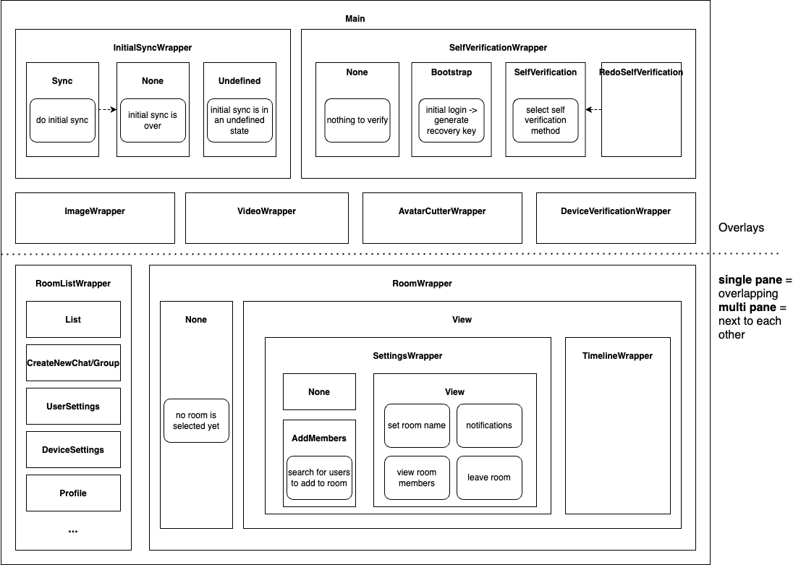

# Trixnity Messenger - A headless Matrix messenger SDK

Trixnity Messenger provides extensions on top of [Trixnity](https://gitlab.com/trixnity/trixnity)
geared towards building a multiplatform messenger. It is agnostic to the UI and supports all technologies that are
interoperable with
Kotlin. UI frameworks that are reactive like
[Compose Multiplatform](https://www.jetbrains.com/lp/compose-mpp), [SwiftUI](https://developer.apple.com/xcode/swiftui/)
, or [ReactJS](https://reactjs.org/) are best suited, since the changes in Trixnity Messenger can be reflected in the
component by binding to the view model.

**You need help? Ask your questions
in [#trixnity-messenger:imbitbu.de](https://matrix.to/#/#trixnity-messenger:imbitbu.de).**

## TI-Messenger

Are you looking for a TI-Messenger SDK? Trixnity Messenger is the base for our TIM SDK. If you want to know more,
contact us at [contact@connect2x.de](mailto:contact@connect2x.de).

## UI

If you are just interested in the UI and white labelling it, have a look at
this [Readme](trixnity-messenger-compose-view/README.md).

## iOS Client

Trixnity Messenger also has support for iOS devices. Warning: The implementation is partly incomplete and experimental.
If bugs occur, please report them.

## MVVM

Trixnity Messenger follows the MVVM pattern, in particular it represents the view model (VM) part. Trixnity is the
model (M), containing all Matrix-related logic. The view (V) on top of Trixnity Messenger is the presentation geared
towards the user.


This patterns frees the UI layer from lots of logic that can be complicated (and thus needs to be tested). In an ideal
case the UI just consumes information provided by the view model and presents it. When user interaction occurs, the
corresponding methods in the view model are called (which can lead to changes in the model and therefore the view model)
.

This is an overview on how different UI technologies can be used on top of trixnity-messenger:


## Getting Started

First you need to add the maven repository:

```kotlin
maven("https://gitlab.com/api/v4/projects/47538655/packages/maven")
```

Now you are able to add trixnity-messenger as dependency to your project:

```kotlin
implementation("de.connect2x:trixnity-messenger:<version>")
```

Just create `MatrixMessenger` including the view model tree that is used in your app.

```kotlin
val matrixMessenger = MatrixMessenger.create()
```

Create a root node in your UI framework and pass the `RootViewModel` to it by calling `matrixMessenger.createRoot()`.
In Compose Multiplatform on the desktop, it looks something like this:

```kotlin
application {
    Window("My App") {
        MyMatrixClient(matrixMessenger.createRoot())
    }
}
```

where `MyMatrixClient` is a `@Composable` function that gets the `RootViewModel` as a parameter.

Now you are ready to react to different states of the routing in the `RootViewModel`.

### Multi profiles/tenancy

`MatrixMessenger` has support for multiple Matrix accounts, but by default it is not possible to have
different `MatrixMessenger` instances in the same application (e.g., for a multi-tenancy feature).

This feature is added by `MatrixMultiMessenger` (which inherits from `ProfileManager`). It allows to create, delete and
select profiles. Profiles are used to separate `MatrixMessenger`s . When you want to use a `MatrixMessenger`, you first
decide on the profile and then have access to the current active `MatrixMessenger`. Unlike multiple Matrix accounts
within `MatrixMessenger`, which are active at the same time, only one profile in `MatrixMultiMessenger` can be active at
the same time. Under the hood, `MatrixMultiMessenger` creates another directory level on targets supporting filesystems
or adds a prefix to all storage-keys on the web target. By default, the last active profile is loaded on start
of `MatrixMultiMessenger`.

Currently, it is not possible to migrate from `MatrixMessenger` to `MatrixMultiMessenger`, so we recommend to always use
`MatrixMultiMessenger` and create a single profile on first start (for example by using the helper
extension `MatrixMultiMessenger.singleMode`).

Creating a `MatrixMultiMessenger` is similar to creating a `MatrixMessenger`:

```kotlin
val matrixMultiMessenger = MatrixMultiMessenger.create()
```

### Routing

The `RootViewModel` itself does not do much on its own, but is a point where routing kicks in. Different views in the
view models are organized in stacks that show one view on top and possibly some views behind the top stack (
see [Decompose routing](https://arkivanov.github.io/Decompose/navigation/overview/)).

In our case, let's have a look at `rootViewModel.rootStack`. It returns
a `Value<ChildStack<RootRouter.Config, RootRouter.RootWrapper>>`, i.e. a value changing over time that is providing the
UI with an instance of `RootRouter.RootWrapper`. In a first step, let's observe this value and react to changes:

```kotlin
// this code has to be called from a `suspend` function
rootViewModel.rootStack.toFlow()
    .mapLatest { it.active.instance }
    .collect { wrapper ->
        when (wrapper) {
            is RootRouter.RootWrapper.None -> {} // draw an empty UI
            is RootRouter.RootWrapper.MatrixClientInitialization -> {} // show initialization of the MatrixClient (aka loading screen)
            else -> {} // add more cases    
        }
    }
```

In case you are using Compose as your UI framework, Decompose has
some [helpers](https://arkivanov.github.io/Decompose/extensions/compose/#navigating-between-composable-components) for
routing.

#### Routing overview

To better understand how the routers are connected, the following (incomplete) overview might help. Many details are
left out for clarity.





## Configuration

Trixnity Messenger has multiple ways to configure the client to your needs.

### Change default configuration

The class `MatrixMessengerConfiguration` contains information that is used to determine some folder names and other data
in
the lifecycle of the messenger. To override the standard configuration use `MatrixMessenger.create`:

```kotlin
val matrixMessenger = MatrixMessenger.create {
    appName = "Dino Messenger"
    appId = "org.example.dino.messenger"
    // ... more config ...
}
```

### Notifications

Trixnity Messenger can show system notifications using [Sysnotify](https://gitlab.com/connect2x/sysnotify).

#### NotificationProvider

A `NotificationProvider` decides when notifications should be retrieved. Usually this would be a push service, but long
polling would be also a szenario. There are a few default implementations:

- `NoOpNotificationProvider` does nothing and can be used when no other provider is needed (usually on Desktop).
- `PushNotificationProvider` can be inherited to implement a push based notification provider.
    - `FcmPushNotificationProvider` (dependency `de.connect2x:trixnity-messenger-notification-fcm`)
    - `ApnPushNotificationProvider` (dependency `de.connect2x:trixnity-messenger-notification-apn`)
    - `UnifiedPushNotificationProvider` (dependency `de.connect2x:trixnity-messenger-notification-unifiedpush`)

To set a notification provider, a DSL in `MatrixMultiMessengerConfiguration` can be used. For example:

```kotlin
addFcmPushNotificationProvider()
```

### Adjusting the log level

Currently the log level can be adjusted using environment variables and config files
employed by the underlying logging implementation.

An exception to this being the Web client, where the log level may be adjusted using
the `?loglevel=LEVEL` query parameter, where `LEVEL` can be one of the constants described
in Kotlin Logging's `Level` enum.

### MatrixClientConfiguration

If you want to change the underlying `MatrixClientConfiguration`, you can register a
`ConfigureMatrixClientConfiguration` in the DI:

```kotlin
single<ConfigureMatrixClientConfiguration>(named("myConfig")) { // don't forget to name the singleton
    ConfigureMatrixClientConfiguration {
        autoJoinUpgradedRooms = false
    }
}
```

### Add HttpClientEngine

Although Ktors `HttpClient`s used by Trixnity (Messenger) automatically use a `HttpClientEngine` defined in the
classpath, it is highly recommended to explicitly set it in the configuration. Only that way, it can be shared between
all `HttpClient` instances. Otherwise, each `HttpClient` creates a new `HttpClientEngine`, which can lead to performance
issues on heavy usage of the SDK.

### Change the default behavior of view models

You can customize the messenger SDK to fit your needs with the help of dependency injection (DI). Trixnity Messenger
uses [Koin](https://insert-koin.io/) for this.

Suppose you want to deliver a demo version of your messenger and with it, want to fix the server url when the client
tries to login the user to a Matrix server. To do this, you have to do the following:

* provide an alternative implementation to a view model interface, here `AddMatrixAccountViewModel`

```kotlin
  class MyAddMatrixAccountViewModel(
    viewModelContext: ViewModelContext,
    addMatrixAccountViewModel: AddMatrixAccountViewModelImpl,
) : ViewModelContext by viewModelContext, AddMatrixAccountViewModel by addMatrixAccountViewModel {

    private val isDemoVersion: Boolean = false // TODO: compute from config or runtime parameter
    val canChangeServerUrl: Boolean = !isDemoVersion
    override val serverUrl: MutableStateFlow<String> =
        MutableStateFlow(if (isDemoVersion) "https://myUrl" else addMatrixAccountViewModel.serverUrl.value)
}
```

Then, we have to register the new view model in a module:

```kotlin
fun addMatrixAccountModule() = module {
    single<AddMatrixAccountViewModelFactory> {
        object : AddMatrixAccountViewModelFactory {
            override fun create(
                viewModelContext: ViewModelContext,
                onAddMatrixAccountMethod: (AddMatrixAccountMethod) -> Unit,
                onCancel: () -> Unit
            ): AddMatrixAccountViewModel {
                return MyAddMatrixAccountViewModel(
                    viewModelContext,
                    AddMatrixAccountViewModelImpl(viewModelContext, onAddMatrixAccountMethod, onCancel),
                )
            }
        }
    }
}
```

Finally, add it to the modules of `MatrixMessenger`. You should always extend the default modules
from `createDefaultTrixnityMessengerModules()`:

```kotlin
val matrixMessenger = MatrixMessenger.create {
    modulesFactories += ::addMatrixAccountModule
}
```

When you start your application with this configuration, the implementation of `AddMatrixAccountViewModel` will be your
customized version `MyAddMatrixAccountViewModel` and your UI can use all the properties and methods of it (maybe a
downcast from the `AddMatrixViewModel` interface is needed).

## Settings

Trixnity Messenger reads and stores settings into a JSON representation. As default there are `MatrixMessengerSettings`
and `MatrixMultiMessengerSettings`, which inherit from `Settings`. To get a type safe representation of `Settings`,
there is `interface SettingsView<S : Settings<S>>`. This allows to define custom views of the Settings, which usually
can be accessed via Kotlin extensions (for example `settings.base`).

### Use settings

Settings are managed by `MatrixMessengerSettingsHolder` and `MatrixMultiMessengerSettingsHolder`. You can inject them
via DI to read or update fields.

### Extend settings

Settings can be extended with own fields.

```kotlin
@Serializable
@NestedSettingsView("custom") // optionally: allows to nest settings in the json under a given key
data class MatrixMessengerCustomSettings(
    val customField: String? = null
) : SettingsView<MatrixMessengerSettings>

val MatrixMessengerAccountSettings.custom
        by settingsView<MatrixMessengerSettings, MatrixMessengerCustomSettings>()
```

This can be read via `settingsHolder.value.custom` and updated
via `settingsHolder.update<MatrixMessengerCustomSettings>{ it.copy(customField="dino") }`.

## i18n

Trixnity Messenger comes with a set of standard translations for some states that can occur. It currently supports
English (en) and German (de). It uses a simple
[Kotlin file](./trixnity-messenger/src/commonMain/kotlin/de/connect2x/trixnity/messenger/i18n/I18n.kt) for all
translations.

It allows the same customizations as view models. In order to change messages, simply override the messages you want to
change by
subclassing [I18nBase](./trixnity-messenger/src/commonMain/kotlin/de/connect2x/trixnity/messenger/i18n/I18nBase.kt).

If you want to add new messages, use the delegation pattern as described
in [View model customization](#change-the-default-behavior-of-view-models) and add more messages.

## Drag and Drop

To support Drag and Drop, you need to get `DragAndDropHandler` from the DI:

```kotlin
val dragAndDropHandler = matrixMessenger.defaultDragAndDropHandler // helper extension
// call functions on dragAndDropHandler
```

## URL / SSO

To support URL handling, you need to get `UrlHandler` from the DI:

```kotlin
val urlHandler = matrixMessenger.defaultUrlHandler // helper extension
// call functions on urlHandler depending on the platform (only on Android, iOS, JVM)
```

On Android you need to call the following in your Activity to put the Activity into your DI:

```kotlin
matrixMultiMessenger.defaultActivityGetter { this@Activity }
// OR
matrixMessenger.defaultActivityGetter { this@Activity }
```

## Custom events

Adding custom events can be done via DI.

First create the custom event type:

```kotlin
@Serializable
data class CatEventContent(
    val hasEaten: Boolean,
    val isTired: Boolean,
) : MessageEventContent {
    // just ignore these properties when you don't need them
    override val relatesTo: RelatesTo? = null
    override val mentions: Mentions? = null
    override val externalUrl: String? = null
}

val catEventContentSerializerMappings = createEventContentSerializerMappings {
    stateOf<CatEventContent>("de.connect2x.cat")
}
```

Define the new view model:

```kotlin
interface CatMessageTimelineElementViewModelFactory : TimelineElementViewModelFactory<CatEventContent> {
    override fun create(
        viewModelContext: MatrixClientViewModelContext,
        content: CatEventContent,
        //...
    ): CatMessageTimelineElementViewModel? =
        CatMessageTimelineElementViewModelImpl(viewModelContext, content)

    override val supports: KClass<CatEventContent>
        get() = CatEventContent::class

    companion object : CatMessageTimelineElementViewModelFactory
}

interface CatMessageTimelineElementViewModel : MessageTimelineElementViewModel<CatEventContent> {
    val isPurring: Boolean
}

class CatMessageTimelineElementViewModelImpl(
    viewModelContext: MatrixClientViewModelContext,
    content: TextBased.Notice,
) : CatMessageTimelineElementViewModel, MatrixClientViewModelContext by viewModelContext {
    override val isPurring: Boolean = content.hasEaten && content.isTired
}
```

Define the UI (you may skip that when you don't use compose-view):

```kotlin
class CatMessageMessageTimelineElementView : TimelineElementView<CatMessageTimelineElementViewModel> {
    override val supports: KClass<CatMessageTimelineElementViewModel> =
        CatMessageTimelineElementViewModel::class

    @Composable
    override fun createInTimeline(
        holder: BaseTimelineElementHolderViewModel,
        element: CatMessageTimelineElementViewModel,
    ) {
        Text("isPurring=${element.isPurring}")
    }

    // ...
}
```

Next, add it to the DI:

```kotlin
fun catEventModule() = modules {
    // don't forget to name the singleton
    single<EventContentSerializerMappings>(named("catEventContentSerializerMappings")) { catEventContentSerializerMappings }
    timelineElementViewModelFactory<CatMessageTimelineElementViewModelFactory> { CatMessageTimelineElementViewModelFactory }
    timelineElementView<CatMessageMessageTimelineElementView> { CatMessageMessageTimelineElementView() }
}

// add the module to the matrix messenger:
moduleFactories += ::catEventModule
```

If your custom event should support a full screen details view when the user clicks/taps on it, you may also implement
`TimelineElementDetailsView` and
add it to the DI using `timelineElementDetailsView<CatTimelineElementDetailsView> { CatTimelineElementDetailsView() }`

## Export room

When exporting a room (via view model or `ExportRoom`), a properties instance needs to be defined.
Currently, the following types do exist by default:

- `PlainTextFileBasedExportRoomProperties`
- `CSVFileBasedExportRoomProperties`

### Custom file format (converter)

The `FileBasedRoomExportRoomSink` can be extended by other file formats. This need three steps:

1. Define properties inheriting from `FileBasedExportRoomProperties`.
2. Implement an instance of `FileBasedExportRoomConverter`
3. Define a factory extending `FileBasedExportRoomSinkConverterFactory` and put this into the DI
   (e.g. via `singleOf(::CustomFactory).bind<FileBasedExportRoomSinkConverterFactory>()`).

For more details take a look at existing `FileBasedExportRoomSinkConverter` like `CSVFileBasedExportRoomSinkConverter`.

### Custom export

It is possible to define a completely custom `RoomExportSink` to export a room to other targets then files. For example
a REST endpoint. For this, a `ExportRoomSinkFactory` needs to be defined and put into the DI
(e.g. via `singleOf(::CustomFactory).bind<ExportRoomSinkFactory>()`).

## Worker

Doing work while the messenger is running can be a common use case. To do that, you can implement
`MatrixMessengerWorker` or `MatrixMultiMessengerWorker` and put it into the DI:

```kotlin
single<MatrixMessengerWorker>(named("MyWorker")) { // don't forget to name the singleton
    MatrixMessengerWorker {
        longRunningTask()
    }
}
```

## Root path

On the JVM (not Android) the root path can be overridden by setting an environment variable
named `TRIXNITY_MESSENGER_ROOT_PATH`.

## Snapshot / Dev builds

Snapshot are published on each commit to main (usually after a merge request is approved and merged).
Append `-DEV-<increasing_number>` to the current version. You can find
the released versions [here](https://gitlab.com/connect2x/trixnity-messenger/trixnity-messenger/-/packages).

You may also add `https://gitlab.com/api/v4/projects/26519650/packages/maven` to your
maven repositories, which contains DEV versions of Trixnity.

## Local builds

If you want to use a locally built version of Trixnity Messenger,
and you're having issues with running `publishMavenToLocal`, build the project using

```shell
./gradlew publishKotlinMultiplatformPublicationToMavenLocal
```

instead and optionally invoke tasks like `publishAndroidReleasePublicationToMavenLocal`,
`publishJvmPublicationToMavenLocal` and `publishJsPublicationToMavenLocal` if needed.
Same goes for macOS/iOS targets.

## Usage from Swift (iOS or Mac)

Trixnity Messenger can also be consumed in Swift code to build native iOS or Mac applications.

### Installation

You can add a dependency with Swift Package
Manager: [gitlab.com/connect2x/trixnity-messenger/spm.git](gitlab.com/connect2x/trixnity-messenger/spm.git).

The easiest way to get started is to look at the example
at: [https://gitlab.com/connect2x/trixnity-messenger/example-swiftui](https://gitlab.com/connect2x/trixnity-messenger/example-swiftui)

### Initialization

In order to use the library from Swift, always ```import TrixnityMessenger``` in your files.

You have to create a `MatrixMultiMessenger` and a `MatrixMessenger` in order to create a `RootViewModel`. Take a look
at the example on how to achieve this.

After the creation of the `RootViewModel`, you can use it inside SwiftUI Views.

### Values and Flows

Trixnity Messengers provides many properties that can change over time. Two data types are used: `Value`s and `Flow`s (
with its specializations `StateFlow` and `MutableStateFlow`). To access those values and get informed when they update,
different helpers can be used.

#### Value

Values represent the changes in the routers (the data type is coming
from [decompose](https://arkivanov.github.io/Decompose)).

Please refer to the example-swiftui code (`StateValue.swift` and `ObservableValue.swift`).

These helpers allow for the following code to work in SwiftUI:

```swift
struct RootView: View {
    @StateValue
    private var stack: ChildStack<RootRouter.Config, RootRouter.Wrapper>
    private var activeStack: RootRouter.Wrapper { stack.active.instance }
    
    init(_ viewModel: RootViewModel) {
        _stack = StateValue(viewModel.stack)
    }
    
    var body: some View {
        Group {
            switch activeStack {
            case let addMatrixAccount as RootRouter.WrapperAddMatrixAccount:
                AddMatrixAccountView(addMatrixAccount.viewModel)
            // more cases ...
            }
        }
    }
}
```

#### Flows

Trixnity Messenger uses [SKIE](https://skie.touchlab.co/) to generate some helper code to get nicer interfaces of Flows
when accessing them from Swift code.

It is possible to access `Flows` and its specializations in SwiftUI code. Most notably is the SwiftUI
helper class `Observing`. E.g., it is used in the `AddMatrixAccountView` of the example:

```swift
var body: some View {
    // ...
    Observing(viewModel.serverDiscoveryState) { serverDiscoveryState in
        // ...
    }
}
```

`Observing` takes care of all changes happening in the `Flow` and propagates changes to SwiftUI so that the UI can
react accordingly. No other translation is needed.

## Usage as a Web app and inside an `iframe`

### Notifications

* if the origin of the parent window and the `iframe` containing the messenger are not the same, notifications will
  **not work**!
* Unfortunately, there is no workaround here. The only clean solution would involve `postMessage()` from the `iframe` to
  the parent window and handling the notification there
    * this requires code changes to Trixnity-Messenger _and_ the containing app!

### Clipboard (Chrome only)

* in the `iframe` HTML element, include the following attribute: `allow="clipboard-read *; clipboard-write *"`

## Contributions

If you want to contribute to the project, you need to sign the [Contributor License Agreement](CLA.md).
See [CLA_instructions.md](CLA_instructions.md) for more instructions.

## Commercial license and support

If you need a commercial license or support contact us at [contact@connect2x.de](mailto:contact@connect2x.de).
