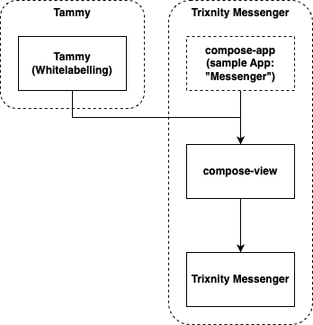
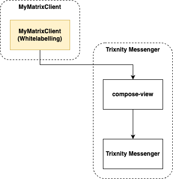
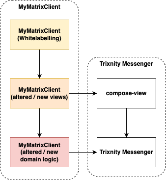

# Trixnity Messenger - Compose View

This project is the base implementation of a Matrix messenger UI
with [Compose Multiplatform](https://www.jetbrains.com/lp/compose-multiplatform/). For a quick start and a running
example, have a look at [compose-app](../compose-app) in this project. If you are looking for a completely whitelabelled
client, check out [Tammy](TODO link missing).

## Platforms

Currently, the compose view supports the following platforms:

* Desktop (Windows, MacOS, Linux)
* Android
* Web (via Canvas) [alpha version]

We are working on an iOS client which will be coming in 2024.

## Goals

The Matrix protocol is a great standard for open and safe communication. In the open-source community, lots of clients
focussing on messaging exist. But we were missing a client that provided the following features:

* support all major platforms (desktop, mobile, web)
* mostly shared code-base for all platforms
* easy and future-proof customization and extensibility (i.e., no need for forking an existing messenger)

With Trixnity and Trixnity Messenger, we have accomplished that goals for the computation layer. What was still missing,
was the UI layer - until now.

## Architecture

If you have checked out this repository, the architecture can be summarized in the following diagram:



`compose-view` depends on `Trixnity Messenger` and uses all of its viewmodels to show information to the user. As a
general rule, a viewmodel like `RoomListViewModel` has a counterpart
`@Composable fun RoomList(roomListViewModel: RoomListViewModel)` compose function, etc.

At its root, there is `@Composable fun Client(rootViewModel: RootViewModel)` as an entrypoint for all platforms.

Since different platforms have different scaffolding, those parts are delegated to the example app `compose-app`. The
desktop app for example provides an AWT window which at some point delegates to `@Composable fun Client(...)` to draw
the contents of the window. On Android, an `Activity` is created which at some point draws the Compose content. For
details, please look into the implementations.

### Whitelabelling

In case you are only interested in providing your own Matrix Messenger without changing the messenger as is,
whitelabelling is the easiest way to get started and still have your own branding or CI.



Instead of using the example app, you can provide your own repository (`MyMatrixClient` in the diagram) and provide your
modifications to the theme of the client there. For more details, see [theming](#theming).

### Altering and Extending the Messenger

There may be times, where simply changing the theme is not enough for your needs of a Matrix messenger. The flexibility
built into Trixnity Messenger and the compose-view allow for great reuse even with the underlying messenger is evolving
in the future.



If you need to alter or extend the existing client logic, you can extend Trixnity Messenger and change existing
viewmodels or provide entirely new viewmodels (red layer). Please refer to the [README.md](../README.md#configuration)
for more information.

On the UI layer (orange), you can consume these altered or new viewmodels and extend the current compose functions with
your own. See [Extensibility](#extensibility) for more details.

On the last layer (yellow), you can also whitelabel your new client.

## Theming

Theming allows to change colors and icons.

### Colors

Have a look into the [theme](src/commonMain/kotlin/de/connect2x/messenger/compose/view/theme) folder, and look out for
everything that starts with `Theme...`. Those are the hooks where customization can be applied.

An example would be a changed light color scheme.

```kotlin
fun myThemeModule() = module {
    // theme
    single<DefaultAccentColor> {
        object : DefaultAccentColor {
            override val value = Color(0xFFEDFCED)
        }
    }

    single<ThemeLightColorScheme> {
        object : ThemeLightColorScheme {
            @Composable
            override fun create(): ColorScheme {
                val settings = DI.current.getOrNull<MatrixMessengerSettingsHolder>()?.collectAsState()?.value
                val accentColor =
                    settings?.base?.accentColor?.let { Color(it.toULong()) }
                        ?: DI.current.get<DefaultAccentColor>().value
                val accentHue = accentColor.hue
                return lightColorScheme(
                    primary = accentColor,
                    onPrimary = Color(0xFF000000),
                    // ... more to define
                )
            }
        }
    }
}
```

For more information on how to use the DI to configure your client, please refer to
the [Trixnity Messenger README](../README.md).

### Icons

* Desktop
    * in the `/resources` folder, provide all icons like found [here](../compose-app/src/desktopMain/resources)
* Android
    * in the `/res` folder, provide all icons that are needed for Android,
      like [here](../compose-app/src/androidMain/res)
    * you can use Android Studio with `new -> image asset -> icon launcher` to create all launcher images

## Extensibility

The UI layer offers a similar extension mechanism as Trixnity Messenger (see [README](../README.md#configuration)).

Instead of viewmodels, here we need to extend `View`s. Each `View` comes with 3 components:

* an `interface [Name]View { @Composable fun create(vm: [Name]ViewModel) }`
* a compose function
  `@Composable fun [Name](vm: [Name]ViewModel) { DI.current.get<[Name]View>().create(vm) }`
* a standard implementation:
  `class [Name]ViewImpl: [Name]View {  @Composable override fun create(vm: [Name]ViewModel) { ... } }`

In the module for the UI layer, every `View` gets wired to its standard implementation (
see [DI.kt](src/commonMain/kotlin/de/connect2x/messenger/compose/view/DI.kt)).

In your application, you can include the standard module and afterward override some views with custom views like this:

```kotlin
fun myViewModule() = module {
    single<RoomListView> {
        object : RoomListView {
            @Composable
            override fun create(roomListViewModel: RoomListViewModel) {
                // my compose code here
            }
        }
    }
}
```

For more information on how to use the DI to configure your client, please refer to
the [Trixnity Messenger README](../README.md).

## Troubleshooting

### Common Images

* common images cannot be saved as SVG, since Android does not support SVG
  yet (https://youtrack.jetbrains.com/issue/CMP-5960)
    * in order to use scalable images, export your SVG (convert text to paths)
    * in the folder [src/androidMain/res](src/androidMain/res), in Android Studio, select `new -> vector asset` and
      create the .xml file of the original .svg
    * move the created .xml file to [src/commonMain/composeResources/drawable](src/commonMain/composeResources/drawable)

### Previews (Android)

* previews for certain views can be found
  in [src/androidMain/kotlin/de/connect2x/messenger/previews](src/androidMain/kotlin/de/connect2x/messenger/previews)
* IntelliJ might not recognize the previews, but opening the project in Android Studio should show the previews
  correctly
